# FDA Submission

**Your Name:** Dhawal Wazalwar

**Name of your Device:** PneumoAssist, AI-powered screening to flag potential pneumonia cases  

---

## Algorithm Description

### 1. General Information

**Intended Use Statement:**  
This software is intended for assisting radiologists and clinicians in identifying pneumonia from frontal-view chest X-rays in adult patients.

**Indications for Use:**  
This software algorithm is intended to assist healthcare professionals by providing automated analysis of chest X-ray images for the detection of pneumonia in patients aged 1 to 100 years. The algorithm is designed to process 2D DICOM chest X-ray images acquired in either the Posteroanterior (PA) or Anteroposterior (AP) view. It serves as a decision-support tool and is not intended to independently diagnose or treat medical conditions. All outputs generated by the algorithm must be reviewed and verified by a qualified radiologist before being used in clinical evaluation or decision-making.

**Device Limitations:**  
- Performance Variability Across Conditions

  The algorithm's diagnostic performance may vary depending on the specific thoracic condition. For instance:

  - **Atelectasis:** Detection can be challenging due to subtle radiographic features, potentially leading to lower sensitivity.

  - **Pleural Effusion:** While often more conspicuous, variations in presentation can affect specificity.

  - **Infiltration:** Overlapping patterns with other pathologies may result in both false positives and negatives.

  - **Pulmonary Edema:** Early or mild cases might be underrepresented, impacting detection accuracy.

  These variations underscore the importance of clinical context and the necessity for radiologist oversight in interpreting algorithm outputs.  

- Hardware Requirements

  The algorithm is optimized for GPU-accelerated environments to ensure timely processing. While it can operate on CPU-only systems, users may experience longer inference times, which could affect workflow efficiency in high-throughput settings.

**Clinical Impact of Performance:**  
The model selected with the highest F1 score prioritizes recall over precision, meaning it aims to minimize false negatives (missed pneumonia cases) at the cost of generating more false positives (incorrectly flagged cases). In clinical settings, this is especially important because missing a pneumonia diagnosis can result in severe patient outcomes or delayed treatment. By highlighting pneumonia cases earlier in the workflow, the model allows for more timely intervention, potentially reducing morbidity and mortality, particularly in vulnerable populations. While false positives may increase the number of flagged cases, they do not add entirely new cases for the radiologist to scan, as they are already reviewing most X-rays. Instead, the model helps to prioritize pneumonia cases earlier, enhancing the workflow without significantly adding to the radiologist's overall workload. Nevertheless, careful clinical interpretation and workflow integration remain essential to fully realize the model's benefits while managing potential drawbacks.

---

### 2. Algorithm Design and Function

**Algorithm Flowchart:**  
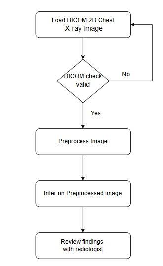

**DICOM Checking Steps:**  
- Check PatientPosition: should be either 'PA' or 'AP'  
- Check Modality: should be 'DX'
- Check Body Part: should be 'CHEST'

**Preprocessing Steps:**  
- Image resizing to 1x224x224x3 pixels  
- Pixel value normalization using train dataset mean and standard deviation

**CNN Architecture:**  
- Base: VGG16 (pretrained on ImageNet)  
- Top layers:  
  - Global Average Pooling  
  - Dense(128, ReLU)  
  - Dropout(0.25)  
  - Dense(1, Sigmoid)

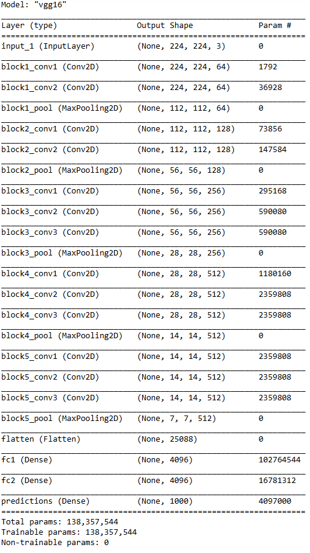

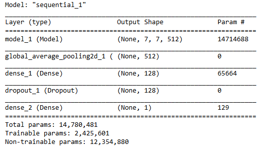

---

## Algorithm Training

**Parameters:**  
- **Augmentations:** Horizontal flip, width/height shift (10%), rotation (30°), shear (0.1), zoom (15%), example samples shown below  
- **Batch size:** 128  
- **Optimizer:** Adam, Learning rate = 1e-4  
- **Frozen layers:** First 17 layers of VGG16 (up to `block5_conv2`)  
- **Fine-tuned layers:** From `block5_conv3` onward  
- **Custom layers added:** GAP → Dense(128) → Dropout(0.25) → Dense(1, Sigmoid)

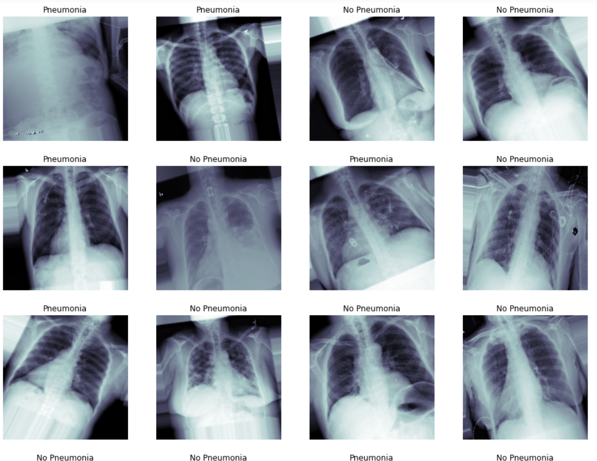

**Training Visualization:**  
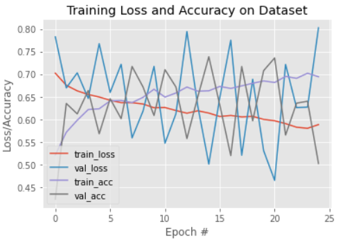

**Precision-Recall Curve:**  
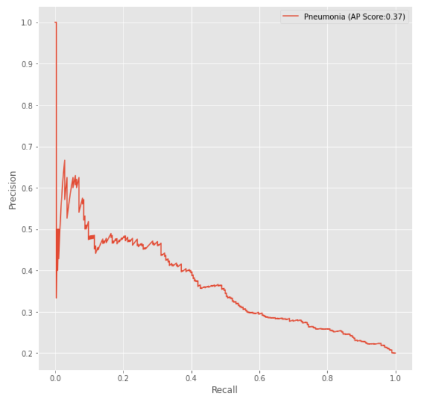

**F1 Score vs Threshold Curve:**  
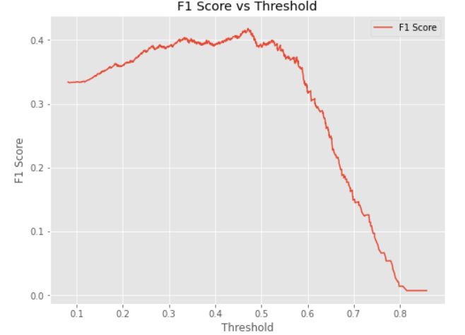

**Final Threshold and Explanation:**  
The threshold of **0.4711** was chosen to maximize the F1 score (0.4179) on the validation dataset. This balances sensitivity and specificity, minimizing both missed detections and false alarms.

---

## Databases

Dataset used for this project is NIH ChestX-ray14 public dataset with total 112120 2D X-ray images in it. From exploratory data analysis, the following insights can be drawn:
 - **Gender Distribution:** The dataset contains more data points from men. However, there is sufficient data from women as well, which can be utilized for effective model training and optimization.
 - **Patient Age Distribution:** There are noticeable outliers with some patient ages exceeding 150, 200, and even 300. To optimize the model, the focus will be restricted to the age range of 0 to 100.
 - **Patient View Distribution:** The dataset has a higher representation of the PA view compared to the AP view. Nonetheless, there is enough AP data available to contribute effectively to model optimization.

An 80:20 train-validation split strategy was used, with 80% of the data for training and 20% for validation. To ensure balanced learning, the training set includes an equal number of pneumonia and non-pneumonia cases. The validation set maintains a 1:4 pneumonia to non-pneumonia ratio to reflect real-world class imbalance.
 
**Description of Training Dataset:**  
- **Number of cases:** 2288 (balanced for pneumonia and non-pneumonia)  
- **Patient demographics:** Patient aged between 1 to 100 years old

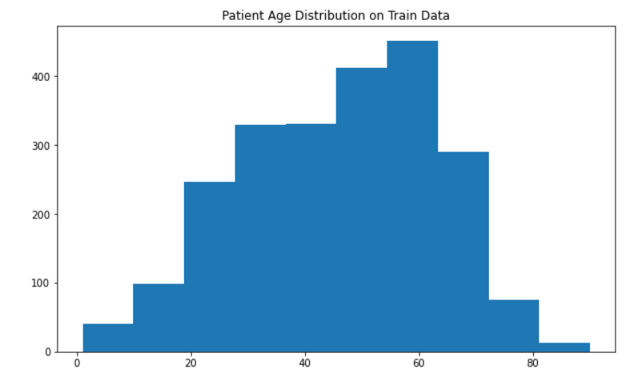

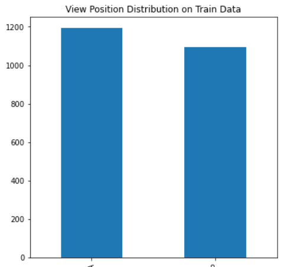

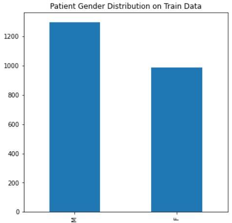

**Description of Validation Dataset:**  
- **Number of cases:** 1430 (20% pneumonia cases)  
- Imbalanced to reflect real-world distribution

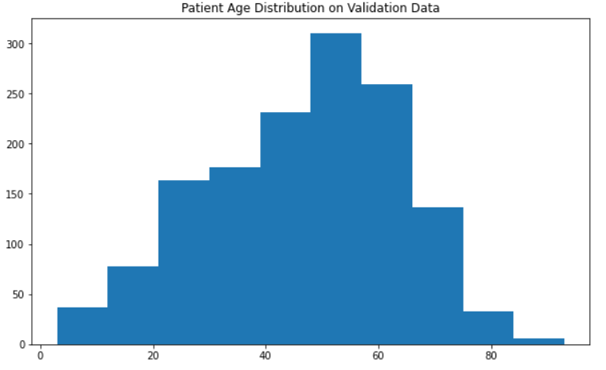

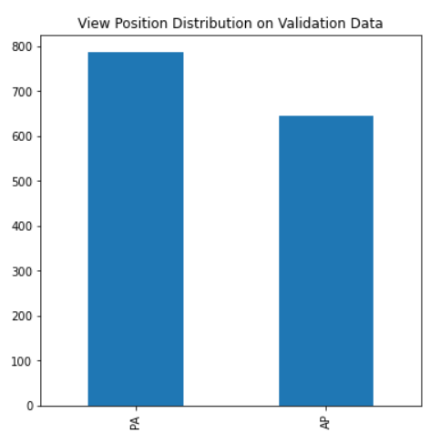

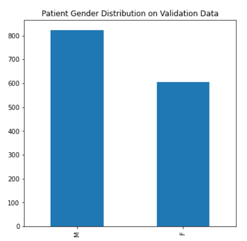

---

## Ground Truth

In this project, each of the 112,120 2D chest X-ray images was accompanied by ground truth in the form of radiological findings, provided in a separate column titled 'Finding Labels' in an Excel sheet.

The dataset includes the following conditions:
'Atelectasis', 'Cardiomegaly', 'Consolidation', 'Edema', 'Effusion', 'Emphysema', 'Fibrosis', 'Hernia', 'Infiltration', 'Mass', 'No Finding', 'Nodule', 'Pleural_Thickening', 'Pneumonia', 'Pneumothorax'.

Notably, 'No Finding' was a distinct label and was not combined with any other findings.

---

## FDA Validation Plan

**Patient Population Description for FDA Validation Dataset:**  
- Includes patients aged between 1 and 100 years.  
- Consists of 2D DICOM chest X-ray images acquired in either Posteroanterior (PA) or Anteroposterior (AP) views.
- Both male and female patients should be represented, with appropriate gender balance maintained.
- Ideally, the distribution of Pneumonia and Non-Pneumonia cases should reflect the prevalence observed in real-world clinical settings.

**Ground Truth Acquisition Methodology:**  
For ground truth acquisition, the recommended approach is to use the silver standard, which involves having at least three radiologists independently review and diagnose each image. The final label is determined through a consensus or voting system across their assessments. In some cases, votes may be weighted based on each radiologist's clinical experience to enhance label reliability.

**Algorithm Performance Standard:**  
To evaluate the algorithm's performance on the FDA validation dataset, its F1 score should be compared against the average F1 score of the radiologists involved in ground truth generation. Based on literature review and findings from [1], radiologists achieved an average F1 score of 0.387 (95% CI: 0.330–0.442). The algorithm is expected to demonstrate performance exceeding the average F1 score of the three radiologists.

## References
[1] Rajpurkar, P., Irvin, J., Zhu, K., Yang, B., Mehta, H., Duan, T., Ding, D., Bagul, A., Ball, R.L., Langlotz, C., Shpanskaya, K., Lungren, M.P., & Ng, A.Y. (2017). CheXNet: Radiologist-Level Pneumonia Detection on Chest X-Rays with Deep Learning. arXiv preprint arXiv:1711.05225.