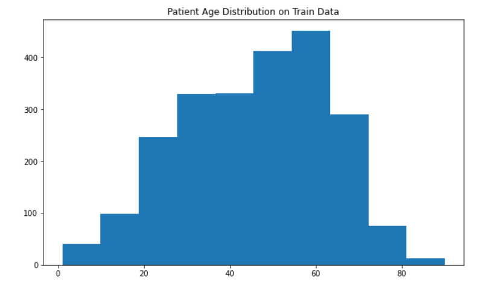
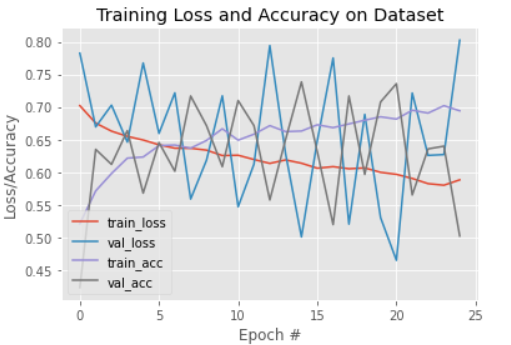

# 📌 Pneumonia Detection from Chest X-Rays

## 🎯 Objective
The goal of this project is to build a deep learning model that can classify chest X-ray images to detect the presence or absence of pneumonia. The intended outcome is to develop a model with diagnostic performance comparable to that of human radiologists, and to prepare the pipeline for submission to the FDA as a software medical device under the 510(k) clearance pathway.

## 🧠 Project Overview
This project was completed as part of the **Udacity AI in Healthcare Nanodegree Program**. It leverages the **NIH Chest X-ray dataset**, which contains over 112,000 chest X-rays labeled for 14 common thoracic diseases. Key components of the project include:
- Exploratory data analysis (EDA) on image metadata and disease distribution.
- Training a convolutional neural network (CNN) to detect pneumonia.
- Validating the model using clinically relevant criteria, aligned with regulatory expectations.

The dataset labels were derived using Natural Language Processing (NLP) applied to radiology reports, with an estimated labeling accuracy of over 90%. The Udacity GPU workspace was used for efficient model training due to the large dataset size.

## 🌍 Pneumonia and X-rays in the Wild
Pneumonia is a highly prevalent respiratory illness and a leading cause of hospitalization and mortality. In the United States alone:
- Over 1 million adults are hospitalized annually.
- Approximately 50,000 deaths occur each year.

Pneumonia is well-suited for AI-based diagnostic tools due to:
1. Availability of a large volume of labeled imaging data.
2. Potential to reduce radiologist workload and improve diagnostic accuracy.

However, diagnosing pneumonia from chest X-rays is difficult because:
- Visual patterns vary with infection stage.
- Findings often overlap with other thoracic conditions.
- Benign abnormalities can mimic pneumonia.

In clinical settings, diagnosis is supported by additional information such as patient history, laboratory tests (e.g. sputum cultures), and comparison with prior images.

## 📦 About the Dataset
The dataset was released by the NIH to support the development of AI algorithms for chest disease detection. It includes labels for the following 14 thoracic conditions:

- Atelectasis  
- Cardiomegaly  
- Consolidation  
- Edema  
- Effusion  
- Emphysema  
- Fibrosis  
- Hernia  
- Infiltration  
- Mass  
- Nodule  
- Pleural Thickening  
- Pneumonia  
- Pneumothorax  

Although the original radiology reports are not publicly available, details about the labeling process can be found [here](https://arxiv.org/abs/1705.02315).

### 📁 Dataset Contents
- `images/`: 112,120 frontal-view chest X-ray images in 1024×1024 resolution (PNG format)
- `Data_Entry_2017.csv`: Metadata including:
  - Image Index  
  - Finding Labels  
  - Follow-up #  
  - Patient ID  
  - Patient Age  
  - Patient Gender  
  - View Position  
  - Original Image Size  
  - Pixel Spacing  

## Project Steps

### 1. Exploratory Data Analysis (EDA.ipynb)

Exploratory Data Analysis was conducted to understand the patient demographics, view positions, disease prevalence, and pixel-level characteristics of chest X-rays in the NIH dataset. The goal was to gain insights that could inform preprocessing, model architecture, and validation strategies.

### 📊 Patient Demographics

- **Gender Distribution**:
  - Slightly more male patients than female.
  - However, data from both genders is well represented, supporting balanced training.

- **Age Distribution**:
  - Some entries show outlier ages above 100, even reaching 300+, indicating possible data entry errors.
  - Filtering to patients aged 0–100 reveals a reasonable distribution suitable for modeling.

- **View Position**:
  - The dataset is dominated by **PA (Posteroanterior)** view X-rays, but includes a substantial number of **AP (Anteroposterior)** views as well.
  - View position can significantly affect the appearance of pathology and should be accounted for in model training.

### 🏷️ Disease Label Analysis

- **Total Images**: 112,120
- **Pneumonia Cases**: 1,431
- **Non-Pneumonia Cases**: 110,689

- **Most Frequent Labels**:
  - `No Finding` (appears in 53.8% of cases, and never co-occurs with other labels)
  - `Infiltration`, `Effusion`, and `Atelectasis` are the most frequent pathological labels.

- **Pneumonia Co-Occurrence**:
  - Pneumonia frequently co-occurs with:
    - **Infiltration**
    - **Effusion**
    - **Atelectasis**
    - **Nodule**
    - **Mass**

### 📦 Disease Distribution by Label
A multi-label expansion of the `Finding Labels` column was performed, creating one-hot columns for all 15 disease categories. This enabled calculation of:
- Individual disease frequencies
- Co-occurrence with pneumonia
- Disease count per patient

### 🧪 Pixel-Level Image Analysis

- Sample images and histograms were plotted for:
  - Pneumonia
  - Infiltration
  - Edema
  - Effusion
  - No Finding

- **Finding**:
  - **No distinct histogram pattern** emerged that clearly distinguishes one disease from another.
  - Visual appearance alone is insufficient for manual separation; deep feature extraction via CNN is necessary.

---

### ✅ Key Insights from EDA

| Area | Insight |
|------|---------|
| **Class Imbalance** | Pneumonia cases are <1.5% of the dataset — heavy imbalance requires weighted loss or data augmentation. |
| **View Impact** | PA view is dominant; view type may influence model predictions and should be considered as input. |
| **Multi-Label Nature** | Diseases often co-occur; model should support multi-label classification (sigmoid + BCE loss). |
| **Pixel Intensity** | Intensity histograms are not discriminative — advanced features are required. |
| **Metadata Utility** | Age, gender, and view can be useful auxiliary inputs. |

### 2. Building and Training Your Model (Build and train model.ipynb)

**Training and Validating Datasets**

To develop a pneumonia classification model from chest X-rays, the training and validation datasets were curated with care based on EDA insights:

- Outliers such as patients aged over 100 were excluded.
- Stratified splitting was used to ensure balanced distribution of pneumonia and non-pneumonia cases.
- Training data was balanced to contain equal pneumonia and non-pneumonia samples (50% each).
- Validation data preserved a natural imbalance (20% pneumonia).
- Demographic analysis (age, gender) and image view positions (PA vs. AP) showed consistent distribution across training and validation sets, ensuring fair evaluation.

**Model Architecture**

Two CNN-based transfer learning architectures were explored:

- **Model 1**: VGG16 pretrained on ImageNet, with top layers removed. A new head with:
  - `GlobalAveragePooling2D`
  - `Dense(128, relu)`
  - `Dropout(0.25)`
  - `Dense(1, sigmoid)` for binary classification  
  Earlier convolutional layers were frozen to retain learned low-level features.

- **Model 2**: ResNet50 pretrained on ImageNet, with the `conv5_block3_out` layer used as a feature extractor, followed by similar custom dense layers.

**Image Pre-Processing and Augmentation**

- All images were resized to **224x224** and normalized using mean and std computed from training data:  
  `Mean = [0.4866, 0.4866, 0.4866]`, `Std = [0.2503, 0.2503, 0.2503]`
- Augmentation strategies included:
  - Horizontal flip
  - Height/Width shift: ±10%
  - Rotation: ±30 degrees
  - Shear and zoom  
  These transformations simulate real-world variability and reduce overfitting.

**Training**

The training pipeline included:

- **Optimizer**: Adam (learning rate = 1e-4)
- **Loss**: Binary cross-entropy
- **Metric**: Binary accuracy
- **Batch size**: 128
- **Epochs**: 25
- **Callbacks**:
  - EarlyStopping (patience = 15)
  - ReduceLROnPlateau on validation loss
  - ModelCheckpoint (best model saved based on val_loss)

Training was conducted using `fit_generator` with `train_gen` and `val_gen`.

**Performance Assessment**

Performance was assessed across multiple dimensions:

#### 🔸 Training & Validation Loss / Accuracy

- **Loss Curve**:
  - Training loss steadily decreased across epochs.
  - Validation loss fluctuated but reached a low of **0.4649** around epoch 21 before increasing again.
- **Accuracy Curve**:
  - Validation accuracy peaked at **~73.8%**, indicating reasonable generalization.
  - Training and validation accuracy diverged slightly in later epochs, hinting at mild overfitting.

#### 🔸 ROC AUC

- The model achieved an AUC of **~0.84**, suggesting good discrimination between pneumonia and non-pneumonia classes.
- The ROC curve indicated a healthy trade-off between sensitivity and specificity.

#### 🔸 Precision-Recall Curve

- The area under the precision-recall curve (AP score) was **~0.68**.
- This is particularly important given the class imbalance in the validation set.

#### 🔸 Threshold Optimization via F1-Score

- **Best classification threshold** determined via F1-score curve was **0.4711**.
- Corresponding **F1-score** was **0.4179**, balancing both precision and recall.
- Precision and recall plots across thresholds help decide optimal clinical trade-offs.

> ⚠️ **Note**: High accuracy may not be the best metric due to class imbalance. Metrics like AUC, AP score, and F1 provide a more realistic assessment for medical use cases.

> Pneumonia detection is inherently difficult—even expert radiologists disagree. Refer to [this paper](https://arxiv.org/pdf/1711.05225.pdf) for human-level benchmarks.

### 3. Clinical Workflow Integration (Inference.ipynb)

The imaging data used for model training in this project was provided in `.png` format to simplify pre-processing and model development. However, in clinical environments, imaging data is typically stored in the DICOM (Digital Imaging and Communications in Medicine) format.

To enable real-world deployment, a **DICOM wrapper** was implemented that converts standard DICOM files into the format expected by the trained model. This wrapper performs the following validations and transformations:

#### ✅ DICOM Pre-Checks:
- **Modality**: must be `'DX'` (Digital Radiography)
- **Body Part Examined**: must be `'CHEST'`
- **View Position**: must be either `'PA'` or `'AP'`

If any of these checks fail, the DICOM file is rejected to ensure compatibility with the training distribution.

#### ✅ Image Preprocessing:
- Normalize pixel values to [0, 1]
- Standardize using training dataset mean and standard deviation
- Resize image to model input size: **(1, 224, 224, 3)**

#### ✅ Inference Pipeline:
- Load trained model using `.json` and `.hdf5` files
- Use a fixed threshold (e.g., **0.4711**) for classification
- Output binary prediction: 1 = Pneumonia, 0 = No Pneumonia

---

**6. FDA Validation Plan**

An FDA Validation Plan and supporting documentation have been prepared separately and are available in the [`FDA_submission.pdf`](FDA_submission.pdf) file.

